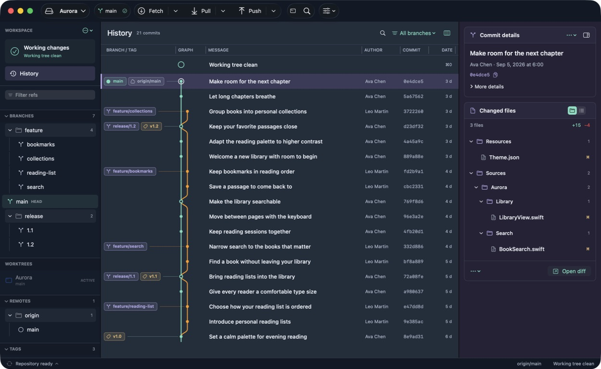
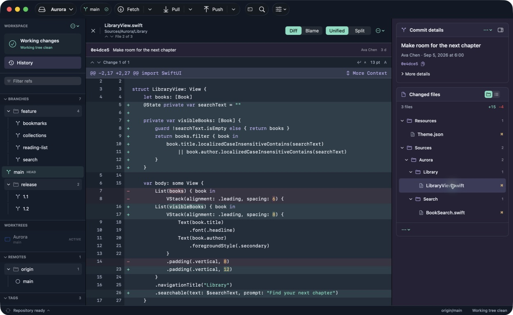

# Branchline

*by Kylindravia*

**A focused Git workspace for macOS.**

Readable history. Full-size diffs. Room to resolve conflicts.

[Report a bug](https://github.com/ahmet12/branchline-releases/issues/new?template=bug-report.yml) · [Suggest a feature](https://github.com/ahmet12/branchline-releases/issues/new?template=feature-request.yml) · [Get help](SUPPORT.md)

> **Preparing for an invitation-only beta.** No application download is available yet.
> This is the official home for Branchline release notes, future downloads, and public feedback.

*Captured from the macOS app using Aurora, a fictional demo repository.*

## Your repository, with room to think

Branchline brings everyday Git work into a native Mac interface. Browse branches as folders,
read their history in a resizable graph, and keep the details of the selected commit close by.

- **History you can follow.** Branch and tag names sit before the graph. Resize columns to fit the way you read.
- **Diffs that take the center.** Selecting a changed file replaces the whole graph area. Move between files from the inspector; close the diff to return to history.
- **A focused conflict workspace.** Compare Current, Incoming, and Base, edit the result, and review each resolution in a workspace that fills the window.
- **Control over your next commit.** Stage files, hunks, or selected lines. Review the staged diff, prepare your message, and keep drafts across sessions.
- **Several repositories, one workspace.** Keep repositories open and switch from the repository dropdown.
- **Everyday Git tools.** Branches, remotes, worktrees, stash, merge, rebase, cherry-pick, revert, blame, and an integrated terminal.

See the full-center diff workspace

*The same fictional demo repository. The file diff occupies the entire graph area.*

## Availability

Branchline is being prepared for macOS 14 or later. Distribution is planned for Apple silicon
and Intel Macs; final compatibility checks are part of beta preparation.

The first beta will be available to testers personally invited by the developer.
When ready, the **same application package** will be available from [Releases](https://github.com/ahmet12/branchline-releases/releases).
Downloading it will be public; using it will require an individual activation code.
There is no public trial or paid checkout available today.

Invited testers will receive their activation details privately. An invitation or beta
license does not automatically include a future paid license. Exact beta terms will
accompany the first release.

## Installation when the first release is available

1. Download `Branchline.dmg` from a release on this repository and open it.
2. Drag Branchline to Applications, eject the disk image, and open Branchline from Applications.
3. Activate with the individual code supplied with your invitation, then open a local Git repository.

These are the planned installation steps. Packages will be published after signing,
Apple notarization, activation, and release checks are complete. The activation code
will belong in Branchline, never in a GitHub issue.

A project-owned Homebrew cask is also planned for people who prefer terminal installation.
It will install the same app and require the same activation. The installation command
will appear here once the cask and first verified release are available.

## Feedback is welcome

You do not need a Branchline license to suggest an improvement or report a problem.
A GitHub account is needed to create or comment on an issue.

Search [existing issues](https://github.com/ahmet12/branchline-releases/issues) first,
then use the bug or feature form. Issues and attachments are public. See
[Support](SUPPORT.md) for private contact, diagnostic reports, and the meaning of status labels.

## Software and terms

Branchline is proprietary software developed by Ahmet Kılıç under the independent
developer brand **Kylindravia**. This repository contains
public product and support material; the application source is maintained separately.
Public download access will not grant an application license.

See [usage and licensing](USAGE.md) and [third-party notice guidance](THIRD_PARTY_NOTICES.md).
